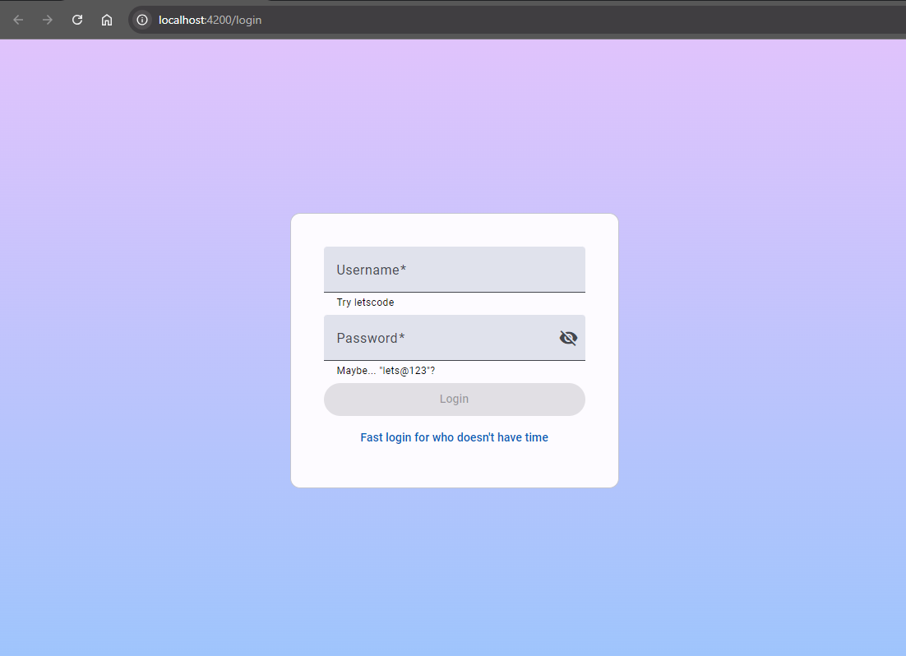
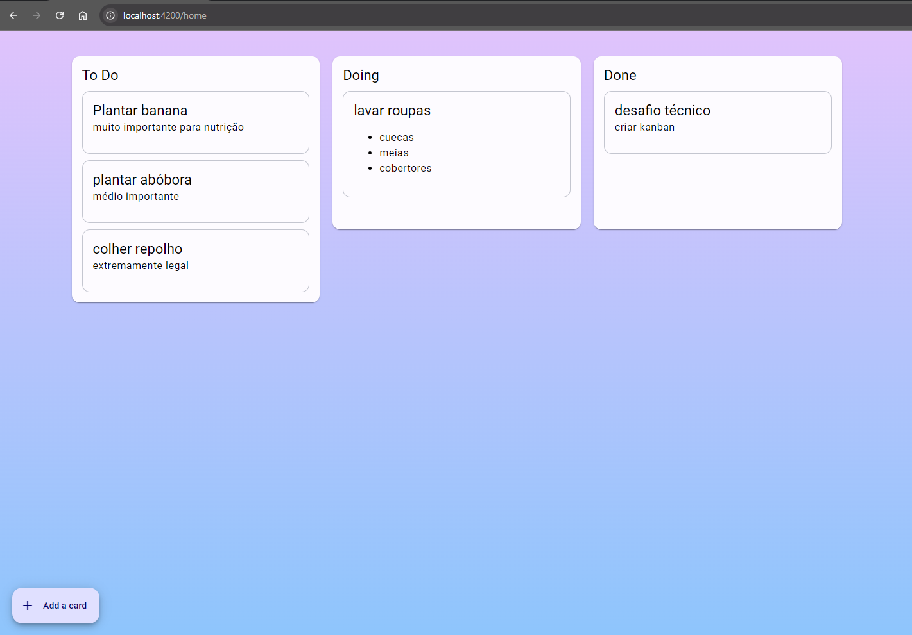
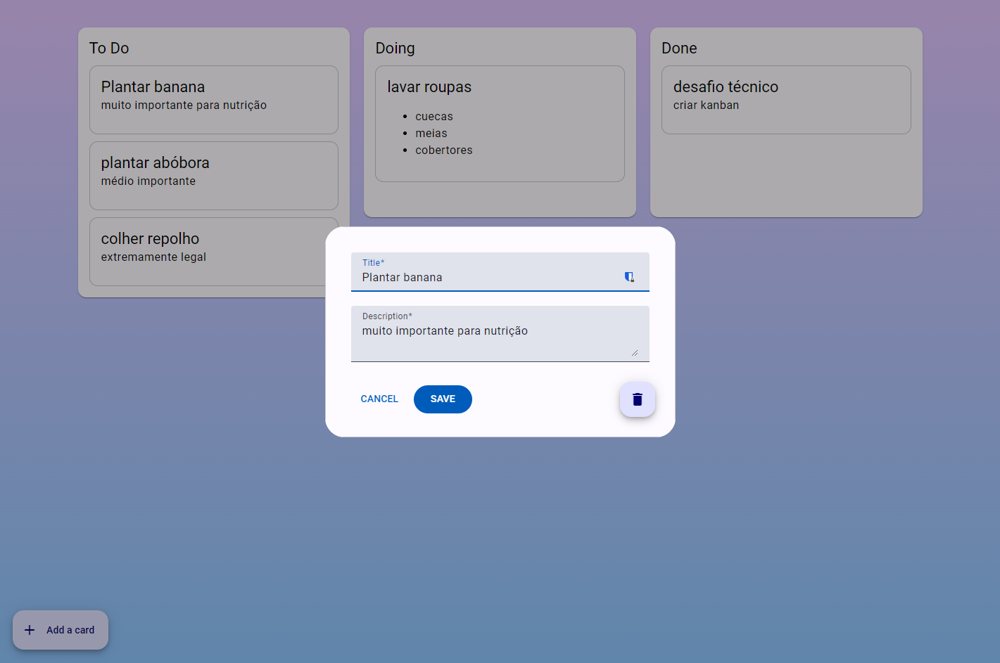
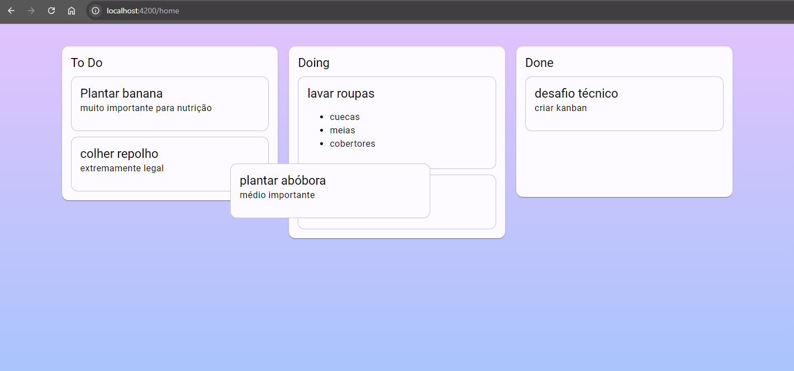

# Desafio Técnico - Frontend

Implementação do Kanban de acordo com as regras descritas no [Desafio Técnico](https://gitlab.com/gabriel.militello1/desafio-tecnico-frontend).

## Imagens do projeto:

- Tela de login

- Home do Kanban

- Modal de criação/edição de tarefa

- Movendo cards entre colunas

## Observações gerais:

- No desafio não é mencionado a necessidade de um login, porém criei uma pois era necessário realizar o login para recuperar o accessToken.

- É dito que o card precisa ter 4 botões, mas removi os botões para mover o card entre as colunas, pois adicionei a funcionalidade de drag and drop.

- Os cards no mode view não mostram as demais ações, apenas quando o mesmo é aberto na view de edição.

- Sei que são decisões que fogem do proposto, mas as tomei em função da experiência que gostaria de oferecer.

# Rodando o projeto

execute o comando `docker-compose up` na raiz do projeto e poderá acessar a aplicação em `http://localhost:4200/`.

A / no final é importante, sem ela vai para a tela de configuração do nginx.

Ou se preferir entre nos diretórios `FRONT` e `BACK` e execute `npm install` e depois `npm run server` e `npm start` respectivamente.

# Tecnologias utilizadas no frontend

- Angular 18
- Angular Material 18
